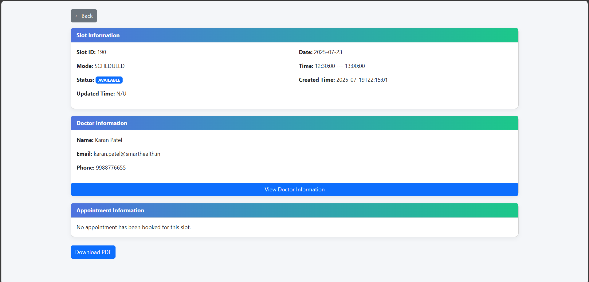

# 🏥 SmartHealth - Healthcare Appointment Booking System (Spring Boot, Java, JWT, MySQL)

[](https://www.oracle.com/java/)  
[](https://spring.io/projects/spring-boot)  
[](https://www.mysql.com/)  
[](LICENSE)  

---

SmartHealth project containing:

- **Backend (Spring Boot)** → `SmartHealth/`
- **User Frontend (HTML, CSS and JavaScript)** → `sh/`
- **Admin Frontend (HTML, CSS and JavaScript)** → `admin/`

## 📂 Structure
SmartHealth/  
  ├─ SmartHealth/ → Spring Boot backend  
  ├─ sh/ → User frontend  
  ├─ admin/ → Admin frontend

## 🚀 Getting Started

### Backend (Spring Boot)
1. Import the Gradle project **SmartHealth** into your IDE (STS, Eclipse, IntelliJ). (Optional)
2. Open `src/main/resources/application.properties` and configure the following:
   - **Database Connection**: Update `spring.datasource.driver-class-name`, `spring.datasource.url`, `spring.datasource.username`, and `spring.datasource.password` according to your database setup.
   - **Image Storage Path**: Set `smarthealth.paths.image-storage-path` to the desired location for storing profile images.
   - **CORS Configuration**: Update properties starting with `smarthealth.cors` to allow cross-origin requests as per your requirements.
   - **Other Properties**: Adjust settings like server port, log file path, etc. as needed.
3. Run the application:
   - **From IDE**: Execute the `main` method in `SmartHealthApplication` class.
   - **From Command Line**:  
     - Navigate to the **SmartHealth/** directory.  
     - Build the project:  
       ```bash
       ./gradlew clean build
       ```
       (Use `./gradlew clean build -x test` to skip tests.)  
     - After a successful build, navigate to `build/libs/` and run:  
       ```bash
       java -jar SmartHealth-1.0.0.jar
       ```

### Common Issues & Fixes
1. **Database Connection Errors** (e.g., `JDBCConnectionException`, driver not found, connection refused):  
   - Verify database driver, URL, host, port, username, and password.  
   - Ensure the database server is running and accessible.  

2. **Mapper Class Dependency Issues** (when running from IDE):  
   - These are usually caused by missing generated `MapperImpl` classes. You can resolve this by either:  
     a) Running  
        ```bash
        ./gradlew clean build
        ```  
        and checking if the `MapperImpl` classes are generated under  
        `build/generated/sources/annotationProcessor/java/main/com/ps/mapper/`.  
        If generated, the application should start. You may need to link source file as above location based on your IDE.
     
     b) Enabling **Annotation Processing** in your IDE settings.  

   > ⚡ Tip: If you frequently modify mapper interfaces, enabling annotation processing in your IDE is recommended. Otherwise, you’ll need to rebuild the project every time via Gradle.

---

### Frontend (User & Admin)

1. **Simple Hosting**  
   - Copy the `sh/` (User Frontend) and `admin/` (Admin Frontend) folders to your hosting server.  
   - Example: If you’re using **XAMPP**, place both folders inside `\xampp\htdocs\`.  
   - Start Apache and access the applications via:  
     - [http://localhost/sh](http://localhost/sh)  
     - [http://localhost/admin](http://localhost/admin)  
     (or based on your server configuration)

2. **Using Virtual Hosts (Recommended for cleaner URLs)**  
   - You can configure custom domain mappings for better accessibility.  
   - Example: If your project resides in `F:/Projects/SmartHealth` and you’re using **XAMPP**, add the following configuration to  
     `\xampp\apache\conf\extra\httpd-vhosts.conf`:  

     ```apache
     <VirtualHost *:80>
         ServerName smarthealth
         DocumentRoot "F:/Projects/SmartHealth/sh"
         <Directory "F:/Projects/SmartHealth/sh">
             Options Indexes FollowSymLinks Includes ExecCGI
             AllowOverride All
             Require all granted
         </Directory>
     </VirtualHost>

     <VirtualHost *:80>
         ServerName admin.sh
         DocumentRoot "F:/Projects/SmartHealth/admin"
         <Directory "F:/Projects/SmartHealth/admin">
             Options Indexes FollowSymLinks Includes ExecCGI
             AllowOverride All
             Require all granted
         </Directory>
     </VirtualHost>
     ```

   - After saving the configuration:  
     1. Restart Apache server.  
     2. Update your system’s `hosts` file to map domains:  
        ```
        127.0.0.1   smarthealth
        127.0.0.1   admin.sh
        ```
     3. Access the apps via:  
        - [http://smarthealth](http://smarthealth)  
        - [http://admin.sh](http://admin.sh)  
        (or according to your chosen domain names)

   >  Note: Change `BASE_API_URL` value according to your backend configuration. You will found `BASE_API_URL` inside `/sh/js/constant.js` and `/admin/assets/js/constant.js` files.

---

## ✨ Features

### 🔑 Common
- 🔒 Stateless session management using **JWT**
- 🛡️ **Role-based access control** (Doctor, Patient, Admin)
- ✅ Secure **Authentication & Authorization**

---

### 👩‍⚕️ Doctor Module
- 👤 **Account Management**
  - 📝 Register, 🔑 Login, 🚪 Logout
  - 📊 Dashboard with key statistics
  - 🧾 Profile management (👀 View & ✏️ Update profile, 🔐 Change password)

- 📅 **Availability Management**
  - ⚡ Generate availability slots using multiple modes:
    - 🔄 **AUTO** (default auto generation)
    - 📍 **CUSTOM_ONE_TIME**
    - ♻️ **CUSTOM_CONTINUOUS**
    - ✋ **MANUAL**
  - 🔧 Update slot generation preferences anytime
  - 🗑️ Bulk delete slots (with validations)
  - 🔍 View availability slots with filters & pagination
  - 📖 View detailed slot information

- 📆 **Appointment Management**
  - 👀 View appointments with filters & pagination
  - 📄 View appointment details
  - 🔄 Update appointment status (**Approved ✅, Completed 🎯, Cancelled ❌**)

- 🌴 **Leave Management**
  - ✍️ Apply for leave
  - 📑 View applied leaves with filters & pagination

---

### 🧑‍🤝‍🧑 Patient Module
- 👤 **Account Management**
  - 📝 Register, 🔑 Login, 🚪 Logout
  - 📊 Dashboard with appointment statistics
  - 🧾 Profile management (👀 View & ✏️ Update profile, 🔐 Change password)

- 🔍 **Doctor Search & Booking**
  - 👨‍⚕️ Search doctors with filters & pagination
  - 📅 View doctor availability slots
  - 📌 Book appointments for self or relatives (sub-profiles)

- 📆 **Appointment Management**
  - 👀 View appointments with filters & pagination
  - 📄 View appointment details
  - ❌ Cancel appointments

---

### 🛠️ Admin Module
- 👤 **Account Management**
  - 📝 Register, 🔑 Login, 🚪 Logout
  - 📊 Dashboard with real-time statistics (users, slots, appointments, leaves, holidays)

- 👥 **User Management**
  - 👩‍⚕️ View doctors & 🧑‍🤝‍🧑 patients with filters & pagination
  - 🔄 Activate / Deactivate users
  - 📄 View detailed user profiles

- 📅 **Slot Management**
  - 👀 View all availability slots with filters & pagination
  - 🗑️ Delete slots
  - 📖 View slot details

- 📆 **Appointment Management**
  - 👀 View all appointments with filters & pagination
  - 📄 View appointment details
  - 🔄 Update appointment status

- 🌴 **Leave & Holiday Management**
  - 📑 View leave requests (Doctors)
  - ✅ Approve / ❌ Reject leave requests
  - 🎉 Manage holidays (➕ Add / 🗑️ Delete with pagination)

---

### ⚙️ Backend Highlights
- 🔐 **Spring Security** → Authentication & Authorization  
- 🔑 **JWT** → Secure stateless session management  
- 📘 **Swagger UI** → API visualization & testing  
- 🗄️ **Spring Data JPA** → Database interaction  
- 🌐 **Spring Web** → RESTful API development  
- 🔄 **MapStruct** → DTO ↔ Entity mapping  
- ✨ **Lombok** → Boilerplate code reduction  
- 📊 **JaCoCo** → Test coverage reporting  
- 🧪 **JUnit** → Unit & integration testing  

---

## 📘 Swagger UI

Swagger UI is integrated for **interactive API documentation**.  
It allows you to:

- 📖 **Explore** all available REST APIs  
- 🧪 **Test** endpoints directly from the browser  
- 📂 View request/response **schemas** and **parameters**

### 🔗 Access
Once your backend is running, open:  
👉 [http://localhost:9902/swagger-ui.html](http://localhost:9902/swagger-ui/index.html)  

---

### ⚠️ Important (JWT Authentication)
Most of our APIs require a **JWT token** in the request header:  
Authorization: Bearer <your_token>
Currently, the Swagger setup does **not include an input field for headers**, so you’ll need to configure Swagger/OpenAPI for **header-based authentication** before you can test secured endpoints directly from Swagger UI.  
Until then, use an API client like **Postman** or **cURL** for testing JWT-protected APIs.

---

### 📸 Screenshot


---

## 📊 JaCoCo Test Report

We use **JaCoCo** to measure **unit and integration test coverage** across the project.  
It provides detailed reports in both **HTML** and **XML** formats.

### ▶️ Generate Report
Run the following Gradle commands from the project root:
Include jacocoTestReport at the end of command to generate test report.

```bash
# Clean, build, run tests and generate test report
./gradlew clean build jacocoTestReport

# Run tests and generate test report
./gradlew test jacocoTestReport
```

📂 Report Location

After execution, you can find the report at: `build/reports/jacoco/test/html/index.html`.
Open the file in your browser to explore detailed coverage (classes, methods, lines, branches).

### 📸 Screenshot


---

## 🧑‍🤝‍🧑 Patient Module Screenshots

### 🏠 Patient Dashboard
- Displays **upcoming appointments** and key **statistics** at a glance.  
- Provides a quick overview of bookings, completed visits, and cancellations.  

📸 Screenshot  


---

### 👤 Patient Profile
- View and update **personal details** (name, dob, height, weight, etc.).  
- Upload / change **profile picture**.  
- Update password for secure login.  

📸 Screenshot  


---

### 🔍 Search Doctor
- Search for doctors using **filters** (specialization, name, degree, availability, etc.).  
- Results are **paginated** for smooth browsing.

📸 Screenshot  


---

### 📅 Book Appointment
- View **doctor availability slots** in real-time.  
- Select a preferred date & time to book.  
- Option to book for **self** or for a **relative (sub-profile)**.  

📸 Screenshot


---

### 📆 My Appointments
- List of all appointments with **filters & pagination**.  
- View detailed appointment information.  
- Option to **cancel appointment** if needed.  

📸 Screenshot  


---

## 👩‍⚕️ Doctor Module Screenshots

### 🏠 Doctor Dashboard
- Displays **today’s appointments**, slot statistics, and quick insights.  
- Helps doctors manage their day efficiently.

📸 Screenshot  


---

### 👤 Doctor Profile
- View and update **personal details** (name, dob, degree, experience, etc.).  
- Upload / change **profile picture**.  
- Update password for secure login.  

📸 Screenshot  


---

### 📅 Manage Availability
- Generate availability slots using multiple modes:  
  - 🔄 **AUTO**  
  - 📍 **CUSTOM_ONE_TIME**  
  - ♻️ **CUSTOM_CONTINUOUS**  
  - ✋ **MANUAL**  
- View generated slots with **filters & pagination**.  
- Delete unwanted slots or update preferences anytime.  

📸 Screenshot  


---

### 📆 My Appointments
- View appointments booked by patients in available slots.  
- Access detailed information for each appointment.  
- Change appointment status (**Approve ✅, Complete 🎯, Cancel ❌**).  

📸 Screenshot  


---

### 🌴 Leave Management
- Apply for leave (single or multiple days).  
- View applied leaves with **filters & pagination**.  
- Leave requests are sent to **Admin** for approval/rejection.  

📸 Screenshot  


---

## 🛡️ Admin Module Screenshots  

### 🖥️ Admin Dashboard  
- Displays overall **platform statistics** including doctors, patients, appointments, and system activity.  
- Provides quick insights for **platform monitoring**.  

📸 Screenshot  
  
  

---

### 👤 Admin Profile
- View and update **personal details** (name).  
- Upload / change **profile picture**.  
- Update password for secure login.  

📸 Screenshot  


---

### 👨‍⚕️ Manage Doctors  
- View all registered **doctors** with filters & pagination.  
- **Activate / Deactivate** doctors.  
- Access detailed **doctor profiles**.

📸 Screenshot  
  
  

---

### 🧑‍🤝‍🧑 Manage Patients  
- View all registered **patients** with filters & pagination.  
- **Activate / Deactivate** patients.  
- Access detailed **patient profiles**.

📸 Screenshot  
  
  

---

### 📅 Manage Slots  
- View all **doctor availability slots**.  
- **Delete** slots if required.  
- View details about slot.

📸 Screenshot  
  
  

---

### 📋 Manage Appointments  
- View all **appointments across the platform**.  
- **Filter, sort, and paginate** appointments.  
- Update appointment status: **Approve, Cancel, Complete**. 
- View Appointment details. 

📸 Screenshot  
  
  

---

### 🏖️ Manage Holidays  
- ➕ Add holidays (festivals, national holidays, etc.).  
- ❌ Delete holidays.  
- Ensures **no slots are generated** on holidays.  

📸 Screenshot  
  

---

### 🩺 Doctor Leave Management  
- ✅ Approve / ❌ Reject doctor leave requests.  
- On approval, system **auto-cancels slots & appointments**.  
- Maintains smooth doctor **availability management**.

📸 Screenshot  
  
